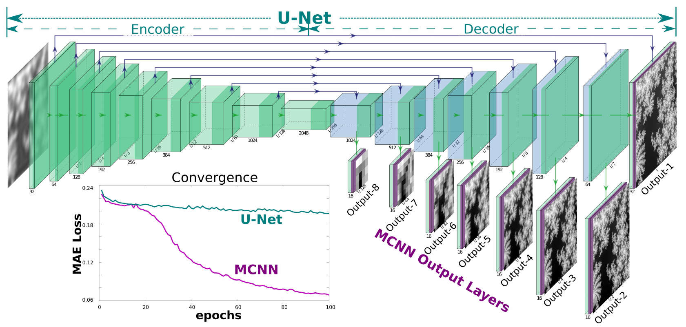

# Multi-scale Convolutional Neural Networks (NCNN)
---

MCNN extends the functionality of the hidden layers in the decoder of a U-Net by connecting them to additional convolution layers to produce coarse outputs, in attempt to match the low-frequency components.
This greatly accelerates the convergence and enhances the stability of the neural-network. The convergence curve with U-net is shown in the figure blow.

### System Requirement (Training)

+ software (python packages)
    + Python (3.7.4)
    + Tensorflow (1.14.0)
    + Keras (2.2.4)
    + numpy (1.17.0)
    + openCV (4.1.1)
    + scikit-image (0.15.0)
    + tifffile (0.9.2)
    + imageio (2.0.10)
    + jupyter-notebook (6.0.1)
    + mss (4.0.0)
    + scipy (1.3.1)
    + matplotlib (3.1.1)

+ recommanded hardware
    + 2T hard disk space (for simulated dataset)
    + 256 GB Memory
    + 2xGTX 1080 Ti GPU

### Demo/Quick Tutorial
For people who is interested in applying MCNN to their own project, check out the `tutorial` folder.

### Phase retrieval applications
For the phase retrieval applications, please check out folder `phase_retrieval`;

### Imageing objects from diffuse reflection
For the imaging objects from diffusive reflection application, please check out folder `diffuse_reconstruction`;

### Denoising STEM images
For the STEM images denoising application, please check out folder `denoising`;

### Pre-trained models

Some of the pre-trained models can be found in [MCNN-DEMO](https://github.com/fengwang/mcnn-demo) repo.

### License
AGPLv3
